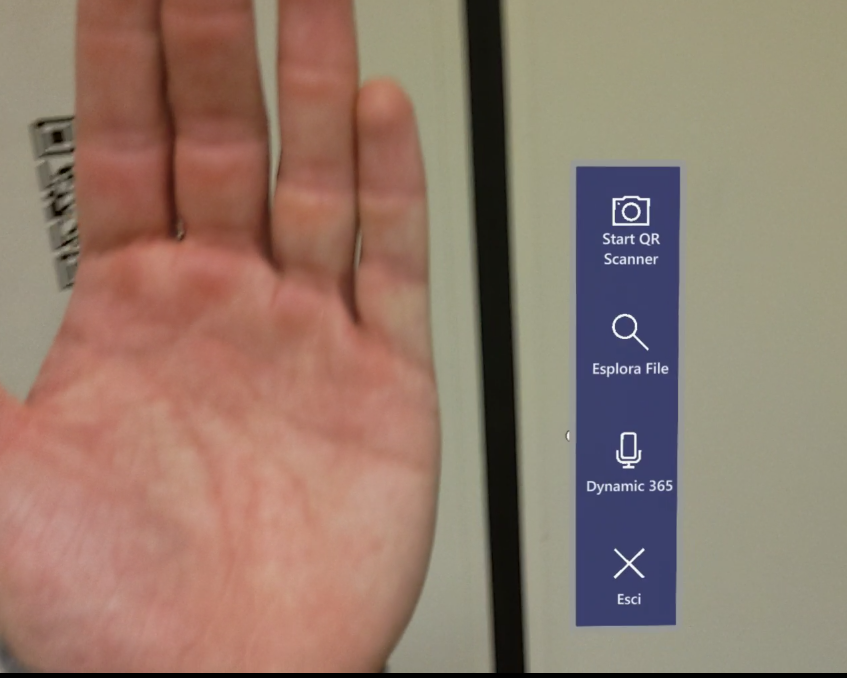
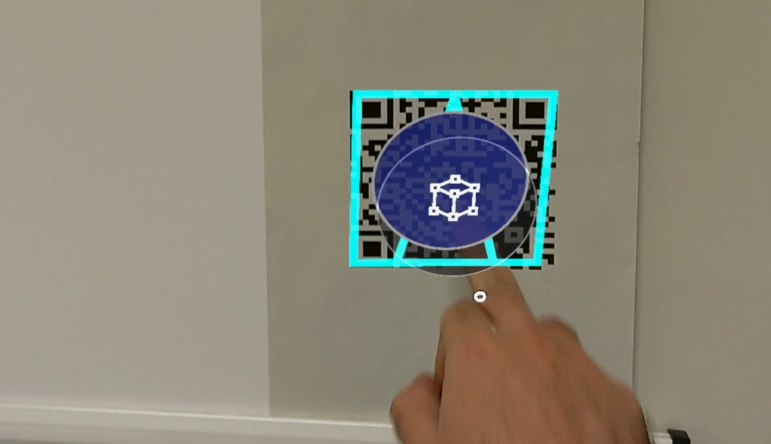
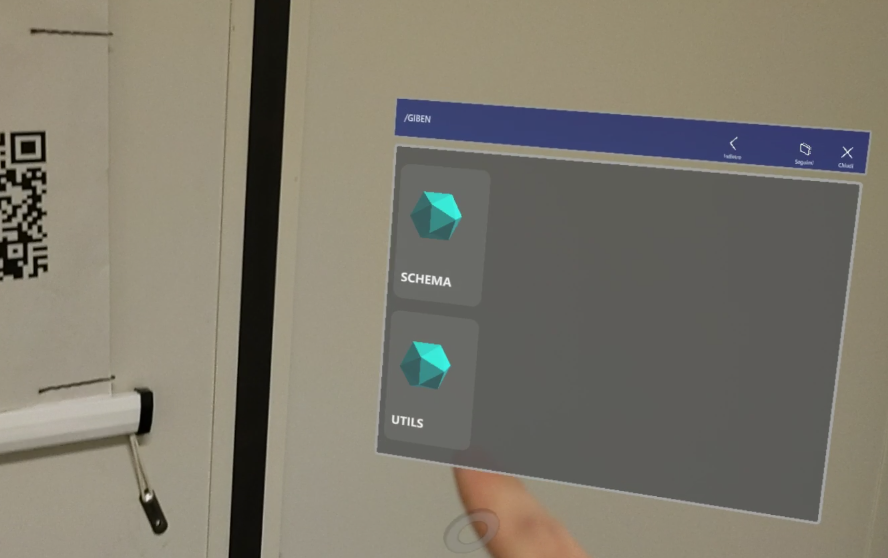
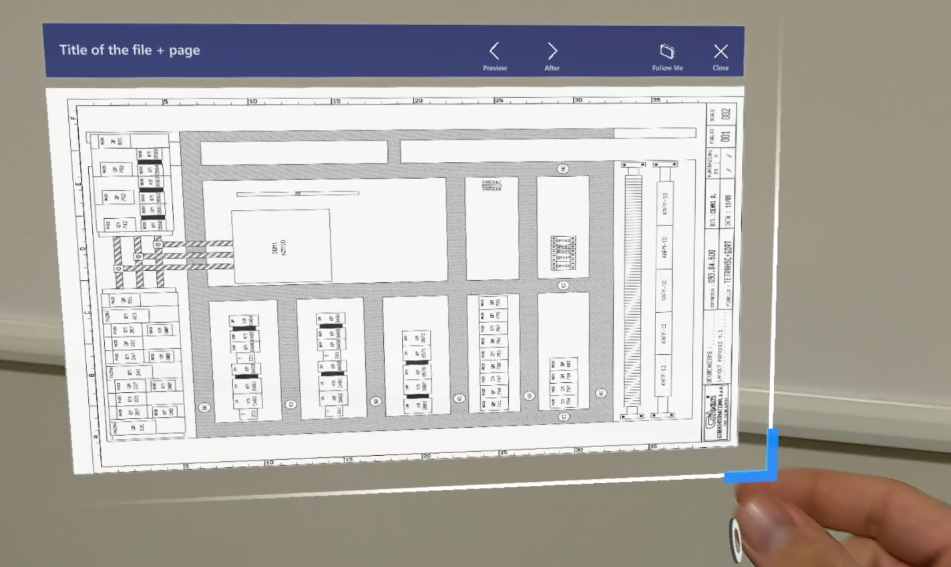

# OPAS, OPerator ASsistant

La build del progetto in formato .zip, il video dimostrativo e la presentazione dell'applicazione sono disponibili al seguente [link](https://drive.google.com/drive/folders/1pkXtWZZ7dKDCkc7lE9rIwaRei0dxx-2v?usp=sharing).

Questa applicazione in realtà aumentata sfrutta la tecnologia Microsoft dell'[Hololens 2](https://www.microsoft.com/it-it/hololens/hardware) per fornire, ad operatori / manutentori di macchine industriali, la possibilità di **accedere a documentazione tecnica** in maniera agevolata oltre che di **registrare** automaticamente l'inizio delle lavorazioni.

L'applicazione è quindi in grado di interfacciarsi con un **web server** che espone delle **API REST** al fine di comunicare con i servizi aziendali oltre che accedere alla documentazione necessaria.

L'app realizzata consta di **due componenti**:

- Applicazione Hololens 2 (Unity),
- Back End Node JS.

## Unity App

*Version Notes:*

- *Unity: 2021.3.4f1*
- *Visual Studio Community: 2022 (17.2.6)*
- *MRTK Feature Tool (Mixed Reality Tool Kit installer): v1.0.2206.1 Preview*
  
L'applicazione grafica per Hololens 2 é stata sviluppata utilizzando il motore grafico [Unity](https://unity.com/) integrato dalle api grafiche specifiche per Hololens fornite da Microsoft: le [**MRTK**](https://learn.microsoft.com/it-it/windows/mixed-reality/mrtk-unity/mrtk2/?view=mrtkunity-2022-05).
Queste librerie forniscono molti script fondamentali per le interazioni dell'utente con l'applicazione in realtá aumentata.

### Application Workflow

Abbiamo sviluppato l'applicazione tenendo conto di un caso d'uso specifico: un'impresa dispone di un servizio di **ticketing** interno in cui vengono registrati i fault avvenuti nei macchinari che devono essere riparati da un manutentore. Un manutentore puó **prendere in carico** un ticket per poi dirigersi verso il macchinario. A questo punto il manutentore puó iniziare le riparazioni avendo a disposizione la documentazione cartacea.

Con lo sviluppo di questa applicazione vengono semplificati ed automatizzati alcuni passaggi di questo processo. Il manutentore infatti (dotato di Hololens 2) é in grado di **inquadrare un codice QR** (sul macchinario di interesse) e registrare l'inizio della propria lavorazione semplicemente cliccando un tasto che verrá posizionato sul codice. A questo punto il manutentore avrá a disposizione la **documentazione digitale** in possesso dell'azienda.

Inoltre l'applicazione fornisce un collegamento all'applicazione Microsoft [**Dynamics 365**](https://dynamics.microsoft.com/it-it/). In caso la documentazione fornita non fosse abbastanza ed il manutentore necessitasse di una ulteriore assistenza, sará quindi possibile effettuare video-chiamate interattive con un assistente utilizzando il proprio contatto Microsoft.

### Features

- **Hand Menu:** Il menu concepito che è stato utilizzato per questa applicazione è un menu **a scomparsa** la cui comparsa viene controllata dai **palmi delle mani**. Inquadrando con l'HoloLens un palmo di una mano qualsiasi verrá mostrato il menu di navigazione dell'app accanto al mignolo e lungo il palmo della mano. L'utilizzo di un menu di questo tipo é stato dettato dalle [best practice](https://learn.microsoft.com/it-it/windows/mixed-reality/design/hand-menu) consigliate da microsoft.

- **QR Scanner:** Lo scanner di codici QR é implementato come un servizio in esecuzione in background. Nell'istante in cui viene rilevato un codice QR viene posizionato su di esso un marker ed un tasto cliccabile. Al click del tasto verrá fatta una richiesta HTTP al server da noi sviluppato contenente l'id della macchina (registrato nel QR code). Tramite questa richiesta sará possibile poi prendere in carico il ticket da parte dell'operatore. Questa funzionalitá é attivabile/disattivabile dal menú.

- **File Explorer:** Il file explorer puó essere attivato dal menú alla mano ed interagisce anch'esso con le rest api. Infatti la documentazione viene servita come file statici all'interno del server per cui per ottenere il path necessario al download del file é stato esposto un endpoint attraverso il quale é possibile ottenere il *contenuto di un certo path*. Grazie alla risposta del server é possibile generare all'interno dell'explorer delle *card* rappresentative delgli oggetti disponibili. Il file explorer é implementato come uno [**slate**](https://learn.microsoft.com/it-it/windows/mixed-reality/mrtk-unity/mrtk2/features/ux-building-blocks/slate?view=mrtkunity-2022-05) a cui sono state aggiunte delle funzionalitá come **la possibilitá di tornare indietro nel path** (tramite l'utilizzo di un tasto supplementare a quelli forniti da MRTK) oltre che la **creazione dinamica** degli oggetti nella [**grid object collection**](https://learn.microsoft.com/en-us/windows/mixed-reality/mrtk-unity/mrtk2/features/ux-building-blocks/object-collection?view=mrtkunity-2022-05) interna allo slate.

- **File Renderer:** Selezionando un file nell'explorer viene aperta una nuova finestra che conterrá il rendering del file selezionato. Trattandosi di PDF i file vengono renderizzati pagina per pagina permettendo la transizione utilizzando dei tasti contrassegnati da frecce (avanti ed indietro). Dall'immagine si vede anche come l'oggetto sia ridimensionabile a piacere (oltre che manipolabile).

- **Dynamics 365 connection:** Se l'utente dovesse avere necessitá di un supporto ulteriore da parte di un tecnico specializzato, sará possibile lanciare l'applicazione Dynamics 365 di Microsoft direttamente da OPAS, rendendo l'app piú integrata.

## Server side App: OPAS backend service

Abbiamo sviluppato il servizio backend per OPAS in [Node.js](https://nodejs.org/en/), che espone l'endpoint per la validazione del QR code e quello per la navigazione nel file system della documentazione.

Per le note tecniche relative alla configurazione e all'avvio, vedi lo specifico [README](./backend-service/README.md).

Di seguito sono riportati i dettagli degli endpoint implementati.

### Endpoints

- **Test endpoint: *\<server-host-name>:3000/*** torna "Ok", per testare la connessione al server;
- **\<server-host-name>:3000/path?path=\<some-path>**: restituisce una lista JSON che presenta le directory e/o i file contenuti nel path specificato;
- **\<server-host-name>:3000/QR?id=\<some-id>**: risponde con lo stesso ID ricevuto (ottenuto dalla decodifica del QR code) per confermare all'operatore la validazione dell'ID. In produzione dovrebbe registrare nel database l'accesso alla macchina con l'ID specificato.

Vengono inoltre serviti i file statici contenenti la documentazione necessaria accessibili previa costruzione del path tramite l'endopint */path* sopra descritto.
